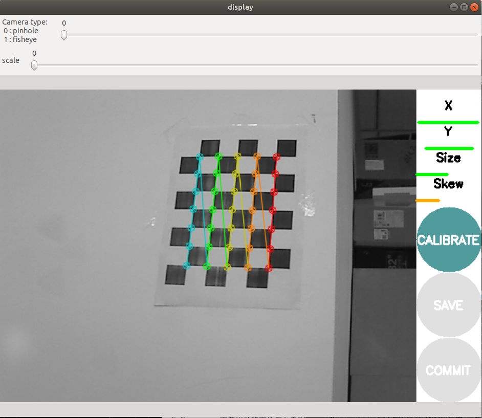
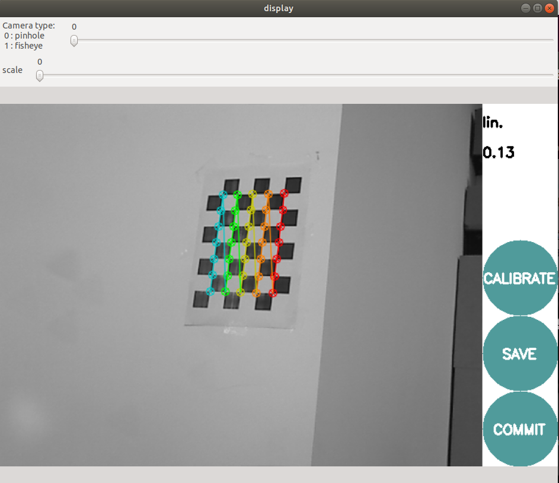
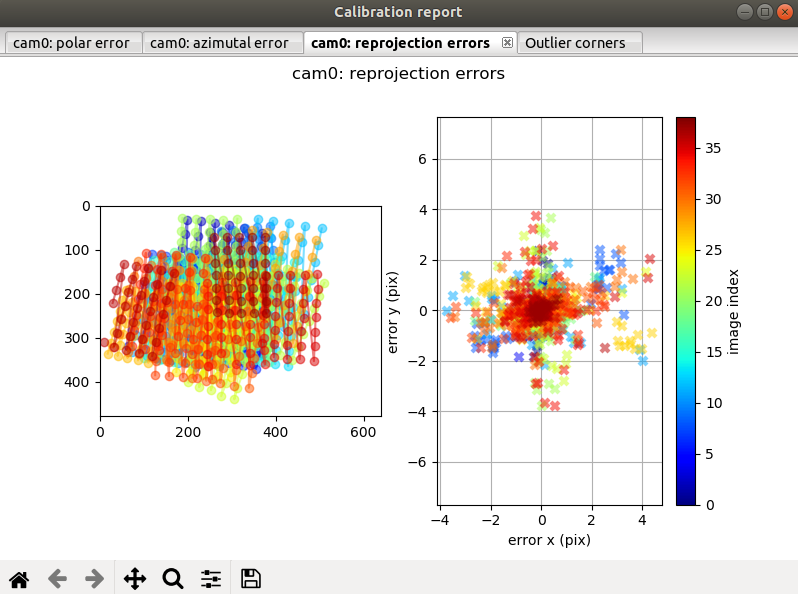

# camera-calibration

## usb_cam

1. 安装**[usb_cam](https://github.com/ros-drivers/usb_cam)**

2. 安装`camera_calibration`

   ```bash
   sudo apt-get install ros-melodic-camera-calibration
   ```

   

3. 准备标定板，本次使用5x7（内部角点）的棋盘标定板。

4. 打开一个终端

   ```bash
   roscore
   ```

5. 打开一个终端，启动`usb_cam`

   ```bash
   roslaunch usb_cam usb_cam-test.launch
   ```

   显示相机画面。

   

6. 打开一个终端，启动`camera_calibration`

   ```bash
   rosrun camera_calibration cameracalibrator.py --size 5x7 --square 0.03 image:=/usb_cam/image_raw camera:=/head_camera --no-service-check
   ```

   显示标定窗口：

   

   

   移动标定板，使条形变成绿色，`CALIBRATE`亮起来后表示可以进行标定，点`CALIBRATE`进行标定，

   

   

   标定完成后，点`SAVE`保存参数。

   

   ```yaml
   image_width: 640
   image_height: 480
   camera_name: narrow_stereo
   camera_matrix:
     rows: 3
     cols: 3
     data: [ 887.70525,    0.     ,  361.78616,
               0.     ,  891.21069,  249.45341,
               0.     ,    0.     ,    1.     ]
   distortion_model: plumb_bob
   distortion_coefficients:
     rows: 1
     cols: 5
     data: [-0.338429, 0.161198, 0.001344, 0.003297, 0.000000]
   rectification_matrix:
     rows: 3
     cols: 3
     data: [ 1.,  0.,  0.,
             0.,  1.,  0.,
             0.,  0.,  1.]
   projection_matrix:
     rows: 3
     cols: 4
     data: [ 844.30878,    0.     ,  367.06983,    0.     ,
               0.     ,  868.54315,  250.23132,    0.     ,
               0.     ,    0.     ,    1.     ,    0.     ]
   ```


## Kalibr

1. 准备`imu.yaml`，`target.yaml`，`cam.bag`。

2. 录制`cam.bag`，需要降低图片的发布频率（4Hz）

   ```bash
   rosrun topic_tools throttle messages /camera/color/image_raw 4.0 /color
   
   # 录制
   rosbag record -O cam.bag /color
   ```

3. 开始标定

   ```bash
   kalibr_calibrate_cameras --target ~/Downloads/checkerboard_7x6_50x50cm.yaml --bag ~/kalibr/camd435i.bag --bag-from-to 26 100 --models pinhole-radtan --topics /color --show-extraction
   ```

   <font color=Red>出现错误</font>：kalibr Attempt to unlock mutex that was not locked 已放弃 (核心已转储)

   <font color=Blue>解决</font>：去掉`--show-extraction`

   ```bash
   kalibr_calibrate_cameras --target ~/Downloads/checkerboard_7x6_50x50cm.yaml --bag ~/kalibr/camd435i.bag --bag-from-to 26 100 --models pinhole-radtan --topics /color
   ```

   <font color=red>问题</font>：使用Kalibr标定单目相机与单目imu联合标定，都出现卡在Extracting calibration target corners
   
   <font color=blue>解决</font>：修改kalibr_calibrate_cameras.py文件中的多线程标签multithreading=multithreading改为multithreading=False [参考](https://blog.csdn.net/u010590316/article/details/89297324)
   
   ```python
   observations = kc.extractCornersFromDataset(cam.dataset, cam.ctarget.detector,
                                                                                     multithreading=False, clearImages=False,
                                                                                     noTransformation=True)
   ```
   
   
   
   
   
   联合标定
   
   修改IccSensors.py文件中的多线程标签multithreading=multithreading改为multithreading=False
   
   ```python
        self.targetObservations = kc.extractCornersFromDataset(self.dataset, self.detector, multithreading=False)
   ```
   
   

